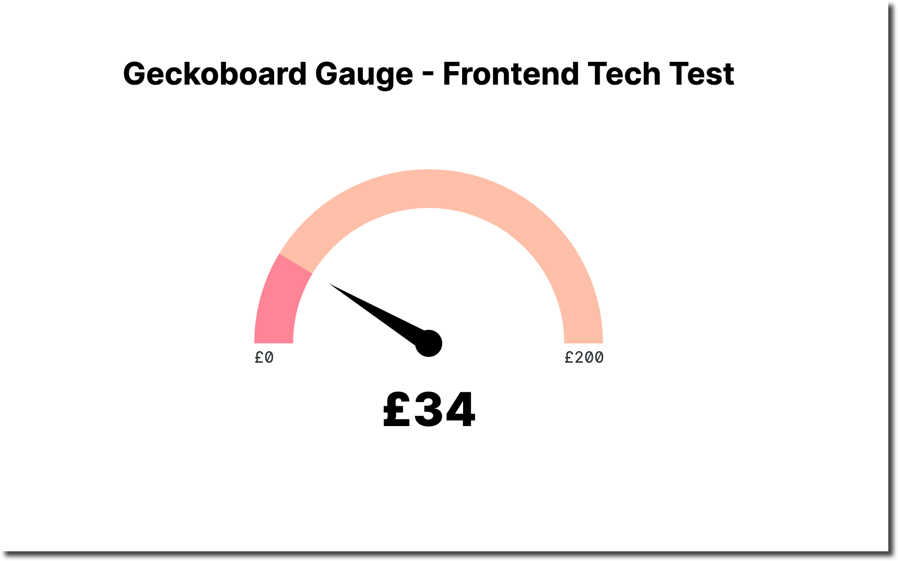

# 🦎 Geckboard Gauge - Frontend Technical Task

 - [Requirements](https://gist.github.com/leocassarani/57ff31870afc603462ea2b1feafecbe4)
 - [View app](https://courageous-bienenstitch-45b699.netlify.app/)

## Built with
- React
- [Vite](https://vitejs.dev/) – Project scaffolding & build tool
- [TanStack Query](https://tanstack.com/query/v4/docs/react/overview) - for fetching and managing data with React
- TypeScript – For project type-safety
- SVG


## To run
Clone down this repo and run a preview of the built app:
```
npm run preview
```
## Screenshot


## Approach
I initially spent some time testing the endpoint to see what data is returned. 

I got up and running using Vite (with TypeScript) as a build tool as it has Hot Module Replacement (HMR), TypeScript support and CSS code splitting.

I've had recent, positive experience using TanStack Query library for fetching and managing data with React. As the server intermittentently returns an error, TanStack Query `useQuery` will retry the query 3 times (default amount) after a short delay if the query request fails, so this felt like a good use-case. 

I decided to create the gauge chart using SVG (rather than Canvas) as I'm more familiar with SVG and the API integrates better with React. I also thought it would be easier to style and animate SVG and offer improved accessibility over Canvas.

As the use of D3.js was not encouraged, I took _inspiration_ from  Matt Rothenberg's [use-gauge](https://github.com/mattrothenberg/use-gauge/) headless React hook (mostly to help with the maths!) 

I created a single `Gauge` "smart" component to consume the data returned from the `useQuery` hook directly. Hoping to improve code readability and avoid prop drilling. I created two arcs: one as a "background" and another that represents the progress of the gauge, tranformed to the correct angle based on the data value provided. I utilised the same value to draw an SVG "needle" pointing to the progress value.

I added _some_ unit tests to test the API network requests by mocking them using Mock Service Worker. In addition, I tested that the main elements were successfully rendered. I would prefer the bulk of the tests to be integration and e2e further down the line. I also quickly tested manually, cross-browser in Chrome, Safari and Firefox.


## Next Steps
Given the time constraints there are several next steps and potential improvements: 
- *Format & Unit:* In the time given, I was unable to implement the currency/format symbols and characters against the numeric values. I'd like to extend the app to allow for and transform multiple formats.
- *Data Validation:* While TypeScript helps to some extent, I didn't validate that the returned value falls within the range of min/max values or that the max value is always greater than the minimum.
- *Add Loading and Error Components*
- *Refactoring:* Create custom hooks to aid reuse/make more composable
- *Improve Accessibility:* After running Axe Dev Tools on the deployed site I'm aware there are several improvements that can be made around the graph and SVG accessibility.
- *Design/UI improvements:* I'd like to improve on the design as it's fairly basic as it stands. Incorporating animation on the gauge needle as well as making the component fully responsive would be first steps.


